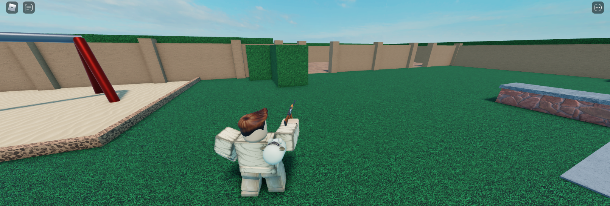

# OTS-Camera-Roblox

## Info
Easily add an Over the Shoulder perspective to your Game which works with Computer, Mobile, & Console!

Fortnite is an excellent example of what an Over the Shoulder perspective is.



## Installing to Roblox
Repo contains all source files, which are imported to Roblox using Rojo.

If you do not use Rojo, you can use provided **OTS-Camera.rbxm** file [here](https://github.com/MonzterDev/OTS-Camera-Roblox/blob/main/OTS-Camera.rbxm) or the [direct download](https://github.com/MonzterDev/OTS-Camera-Roblox/raw/main/OTS-Camera.rbxm).

## Using the Module
1. Add Module to **StarterPlayerScripts**
2. Create a **LocalScript** with the following contents:
```LUA
local Players = game:GetService('Players')

local Player = Players.LocalPlayer
local PlayerScripts = Player.PlayerScripts

local OTS_Camera = require(PlayerScripts:WaitForChild("OTS-Camera"))
OTS_Camera.Enable()
```
3. You may need to change `require(PlayerScripts:WaitForChild("OTS-Camera"))` to point to wherever you put the Module

## Credit
https://github.com/Hasnain123Raza/ROBLOX-OTS-Camera-System/
